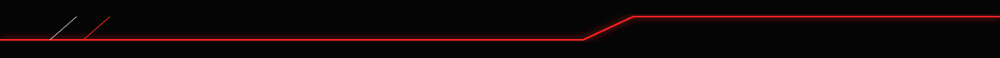

<div align="center">



<br>



### `COMPUTER SCIENCE // AI // ROBOTICS // DRONES`

</div>

---

## ╱ `SYSTEM PROFILE`

<div align="center">

**SOURABH SRS**  
`CSE STUDENT` · `AI EXPLORER` · `ROBOTICS BUILDER`

</div>

I'm a Computer Science Engineering student building my foundation across **software development, AI, robotics and drone technology**.

I prefer learning by making things: writing code, experimenting, breaking systems, fixing them and gradually turning ideas into working projects.

```text
CORE INTERESTS

AI                ████████████████████
ROBOTICS          ███████████████████
DRONE SYSTEMS     █████████████████
SOFTWARE          ████████████████████
AUTONOMOUS TECH   ████████████████
```

---

## ╱ `TECH ARSENAL`

<div align="center">


</div>

<br>

| CORE | TECHNOLOGY |
|:---|:---|
| `LANGUAGES` | Python · Java · C++ · JavaScript |
| `WEB` | HTML · CSS · JavaScript |
| `TOOLS` | Git · GitHub · VS Code |
| `SYSTEMS` | Linux · Development Environments |
| `EXPLORING` | AI · ML · Computer Vision · Robotics · Drones |

---

## ╱ `ROBOTICS CORE`

<div align="center">

<table>
<tr>
<td align="center" width="25%">

### SOFTWARE

`Python`  
`C++`  
`Algorithms`

</td>

<td align="center" width="25%">

### INTELLIGENCE

`AI`  
`Machine Learning`  
`Computer Vision`

</td>

<td align="center" width="25%">

### ROBOTICS

`Automation`  
`Sensors`  
`Control`

</td>

<td align="center" width="25%">

### AUTONOMY

`Drones`  
`Navigation`  
`Autonomous Systems`

</td>
</tr>
</table>

<br>

`SOFTWARE`　╱　`INTELLIGENCE`　╱　`ROBOTICS`　╱　`AUTONOMY`

</div>

**Areas I'm exploring**

`Artificial Intelligence` · `Machine Learning` · `Computer Vision` · `Robotics` · `Automation` · `Drone Technology`
---

## ╱ `ACTIVE LAB`

### `01 // AI SYSTEMS`
Small experiments for learning Python, AI concepts, automation and intelligent systems.

**Stack:** `Python` · `AI` · `ML`

### `02 // ROBOTICS`
Exploring how software can interact with sensors, machines and physical systems.

**Stack:** `Python` · `C++` · `Robotics`

### `03 // DRONE INTELLIGENCE`
Long-term exploration of software, AI and autonomous drone systems.

**Stack:** `Python` · `C++` · `AI` · `Computer Vision`

### `04 // SOFTWARE LAB`
Programming projects used to strengthen engineering fundamentals.

**Stack:** `Java` · `Python` · `C++` · `JavaScript`

---

## ╱ `CURRENT MISSION`

```yaml
SRS_CORE:

  status: "ONLINE"

  learning:
    - Python
    - Java
    - C++
    - Data Structures
    - Artificial Intelligence
    - Machine Learning
    - Git / GitHub

  building:
    - Software Projects
    - AI Experiments
    - Robotics Experiments
    - Drone Concepts

  exploring:
    - Computer Vision
    - Autonomous Systems
    - Intelligent Robotics

  objective:
    "Turn ideas into working systems."
```

---

## ╱ `BUILD PROTOCOL`

<div align="center">

`LEARN`  →  `BUILD`  →  `TEST`  →  `BREAK`  →  `FIX`  →  `IMPROVE`

<br>

**REPEAT.**

</div>

---

## ╱ `CONNECT`

<div align="center">

<a href="https://github.com/SourabhSRS">

</a>

<a href="mailto:YOUR_EMAIL@gmail.com">

</a>

<a href="https://www.linkedin.com/in/YOUR_LINKEDIN/">

</a>

<br><br>

`SYSTEM ONLINE` · `SOURABH SRS` · `BUILD MODE`

</div>

---

<div align="center">


### `CODE // AI // ROBOTICS // DRONES`

</div>
